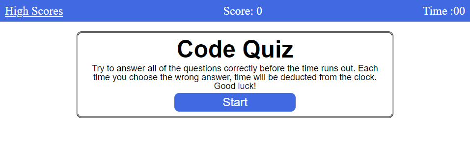

# Code Quiz

This is a quiz made in javascript.  It gets questions from an array, checks the user's choices against stored answers, keeps track of the user's score, and deducts time from the clock if the user chooses the wrong answer.

---
https://ricadbur.github.io/code-quiz/
